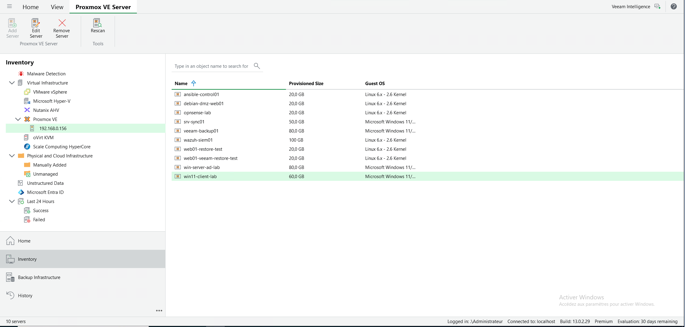
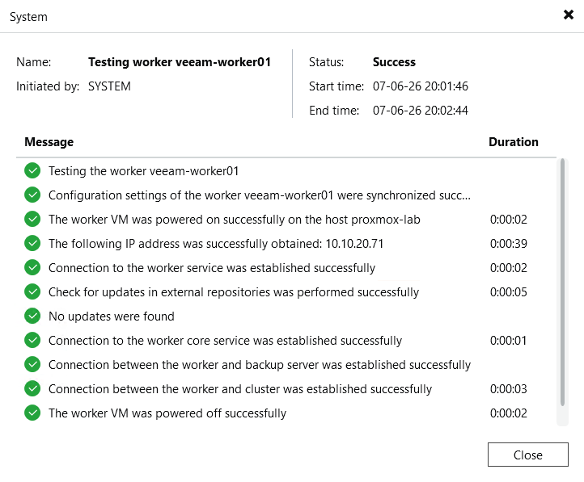
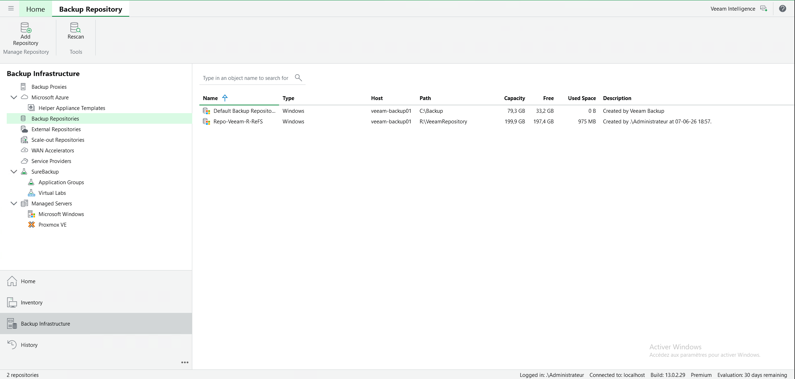
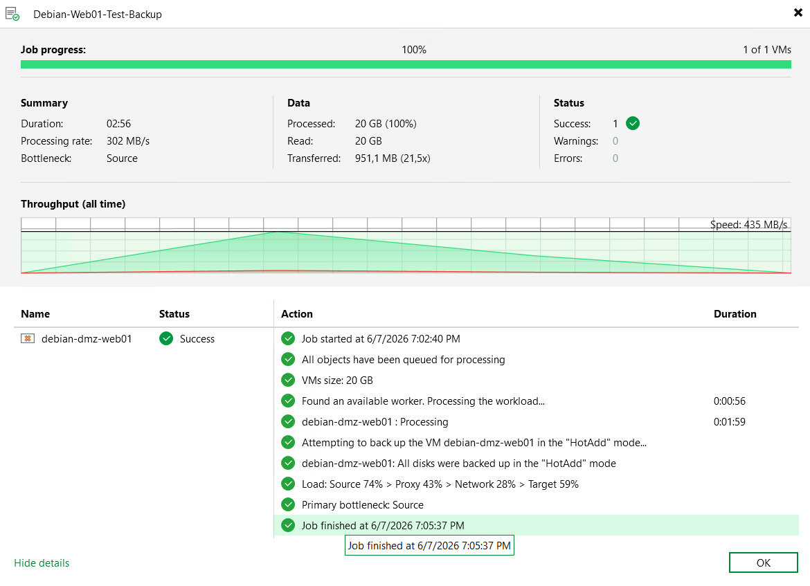
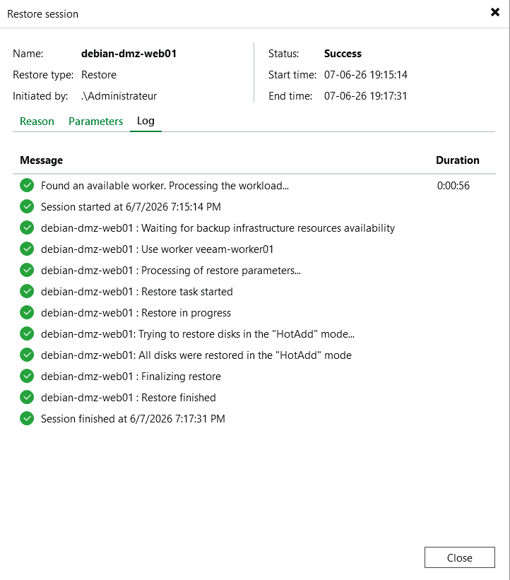
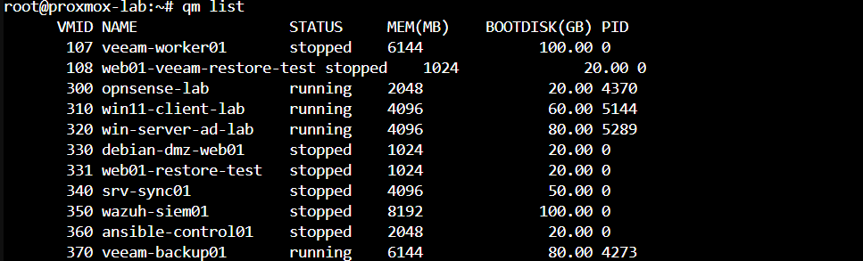
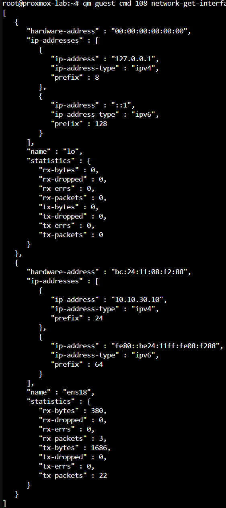
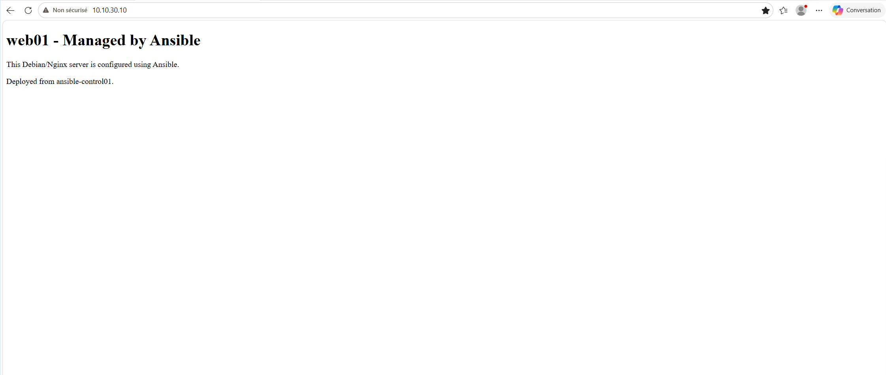
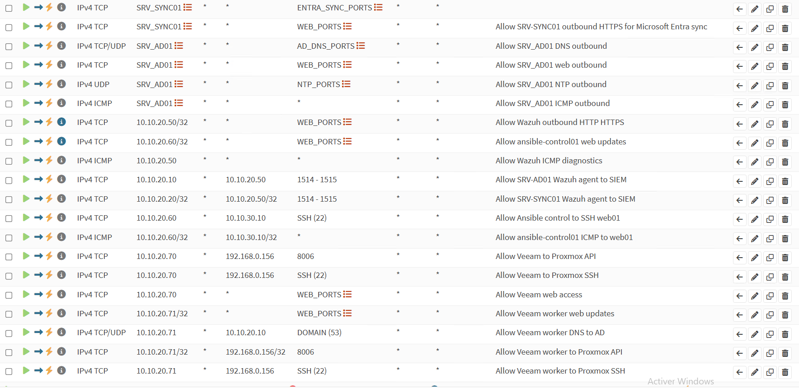

# Veeam Backup & Replication Proxmox Lab

## Overview

This project documents a homelab implementation of Veeam Backup & Replication 13 used to protect virtual machines running on Proxmox VE.

The goal of this lab was to deploy a realistic backup and restore workflow, including a dedicated Veeam backup server, a Proxmox worker appliance, a ReFS backup repository, firewall rules, backup jobs and a full VM restore test.

## Lab Objectives

The main objectives were to:

- Install and configure Veeam Backup & Replication 13.
- Add a Proxmox VE host to Veeam.
- Deploy a dedicated Veeam worker VM for Proxmox backup operations.
- Create a dedicated backup repository using ReFS.
- Run a successful VM backup job.
- Restore a complete VM to a new Proxmox VM.
- Validate the restored VM at the application level.
- Document troubleshooting steps and firewall requirements.

## Lab Environment

| Component | Role |
|---|---|
| Proxmox VE | Virtualization host |
| OPNsense | Firewall and network segmentation |
| Windows Server 2022 | Veeam backup server OS |
| Veeam Backup & Replication 13 | Backup and restore platform |
| Veeam Worker | Proxmox backup worker appliance |
| Debian / Nginx | Test VM protected by Veeam |
| ReFS Repository | Dedicated backup storage |

## Network Layout

| System | IP Address | Network |
|---|---:|---|
| Proxmox VE Host | 192.168.0.156 | Management / Home LAN |
| Veeam Backup Server | 10.10.20.70 | SERVERS |
| Veeam Worker | 10.10.20.71 | SERVERS |
| Active Directory / DNS | 10.10.20.10 | SERVERS |
| Debian DMZ Web Server | 10.10.30.10 | DMZ |

## Backup Repository

A dedicated virtual disk was added to the Veeam backup server and formatted using ReFS with 64K allocation unit size.

| Setting | Value |
|---|---|
| Repository name | Repo-Veeam-R-ReFS |
| Path | R:\VeeamRepository |
| Size | 200 GB |
| File system | ReFS |
| Allocation unit size | 64K |

This is cleaner than storing backups directly on the system disk.

## Backup Job

A backup job named `Debian-Web01-Test-Backup` was created to protect the Debian/Nginx VM.

| Metric | Result |
|---|---:|
| Status | Success |
| Processed | 20 GB |
| Transferred | 951.1 MB |
| Duration | 02:56 |
| Warnings | 0 |
| Errors | 0 |
| Transport mode | HotAdd |

## Restore Test

A full VM restore was performed to a new VM.

| Original VM | Restored VM |
|---|---|
| debian-dmz-web01 | web01-veeam-restore-test |

The restored VM appeared in Proxmox as VM ID 108:

- 108 web01-veeam-restore-test

The restored VM received the expected IP address:

- 10.10.30.10

The Nginx web page was successfully reachable from the lab client, confirming that the restore was functional at both system and application level.

## Firewall Rules

OPNsense was used to control traffic between the SERVERS network, Proxmox management network and DMZ.

Required Veeam-related rules included:

| Source | Destination | Port / Protocol | Purpose |
|---|---|---|---|
| 10.10.20.70 | 192.168.0.156 | TCP 8006 | Veeam to Proxmox API |
| 10.10.20.70 | 192.168.0.156 | TCP 22 | Veeam to Proxmox SSH |
| 10.10.20.70 | Any | TCP 80/443 | Veeam web access |
| 10.10.20.71 | Any | TCP 80/443 | Worker web updates |
| 10.10.20.71 | 10.10.20.10 | TCP/UDP 53 | Worker DNS to AD |
| 10.10.20.71 | 192.168.0.156 | TCP 8006 | Worker to Proxmox API |
| 10.10.20.71 | 192.168.0.156 | TCP 22 | Worker to Proxmox SSH |

Temporary broad rules were used during troubleshooting, then replaced with more restrictive rules.

## Troubleshooting: Veeam Worker Network Issue

### Issue

The first Veeam worker was deployed on vmbr0 and received an IP address in the 192.168.0.x range.

Veeam could deploy the worker, but the worker test remained stuck while trying to validate the worker IP and service connectivity.

### Root Cause

The Veeam backup server was located in the SERVERS network:

- Veeam backup server: 10.10.20.70

The first worker was deployed on another network:

- First worker IP: 192.168.0.190

This caused communication issues between the Veeam backup server, the worker and the Proxmox host.

### Fix

The worker was redeployed on the SERVERS network using vmbr20 with a static IP:

- New worker IP: 10.10.20.71

Additional OPNsense rules were added to allow:

- Veeam backup server to Proxmox API and SSH.
- Veeam worker to Proxmox API and SSH.
- Veeam worker to Veeam backup server.
- Veeam worker to DNS and web update repositories.

After these changes, the worker test completed successfully.

## Screenshots

### Proxmox inventory detected in Veeam

### Veeam worker test successful

### Dedicated ReFS repository

### Backup job success

### Restore session success

### Restored VM visible in Proxmox

### Restored VM IP confirmed

### Restored Nginx page accessible

### OPNsense firewall rules

## Skills Demonstrated

- Veeam Backup & Replication installation and configuration
- Proxmox VE integration
- VM backup and restore workflow
- ReFS repository configuration
- OPNsense firewall rule design
- Network troubleshooting
- Backup validation
- Disaster recovery testing
- Technical documentation

## Final Result

This lab successfully validates a complete backup and restore workflow for a Proxmox VM using Veeam Backup & Replication.

The project demonstrates not only backup creation, but also restore validation, which is the most important part of a real backup strategy.
